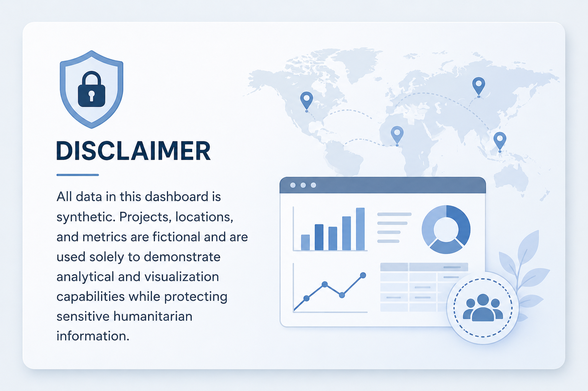

# Humanitarian Data Analytics  Power BI Dashboards and Insights
This repository showcases a collection of interactive Power BI dashboards designed and developed during my tenure with international humanitarian organizations, including UNICEF and the Qatar Red Crescent Society (QRCS).

> [!IMPORTANT]
> **Data Privacy & Compliance:** To comply with data protection policies and non-disclosure agreements (NDAs), the underlying `.pbix` files, data sources, and sensitive operational metrics are strictly confidential. The dashboards displayed below use high-fidelity image snapshots and animated GIF previews featuring simulated or aggregated public-facing data to demonstrate functionality, visual design, and architectural frameworks.

 

## 📊 UNICEF - Nutrition Program End-Year Review (Case Study)
**Organization:** UNICEF 
**Target Audience:** Program Team
### Project Overview
This Power BI project provides executive and financial oversight for a high-stakes UNICEF Nutrition Program using a forensic data lens. The Severe Acute Malnutrition (SAM) dashboard maps regional coverage against annual treatment targets to isolate critical operational bottlenecks. The fund management dashboard audits a $9.7M budget by tracking allocations, hard and soft commitments, and unspent balances. Together, these dashboards bridge the gap between field operations and fiscal accountability to optimize resource distribution and prevent programmatic leakage.  

## 📊 QRCS Yemen Mission - Humanitarian Interventions and Progress Tracker
**Organization:** Qatar Red Crescent Society (QRCS) 
**Target Audience:** Country Team
### Project Overview
This multi-page enterprise dashboard serves as the central monitoring tool for the QRCS Yemen Mission (2021). It provides executive leadership and field teams with a unified, real-time interface to track cross-sectoral humanitarian interventions (CCCM, Food, Health, Shelter, WASH) across various governorates and districts in Yemen. The report transforms complex field operation logistics and medical service delivery data into actionable insights to optimize resource allocation and evaluate project reach.  

 

## 📊 QRCS Refugee Health Care Services Dashboard
> [!NOTE]
> I am currently rebuilding and synthesizing my professional data pipelines and enterprise models into this public portfolio. To respect strict institutional data governance and non-disclosure agreements, all proprietary datasets are being meticulously anonymized or replaced with high-fidelity synthetic data before deployment. Stay tuned for regular updates!

